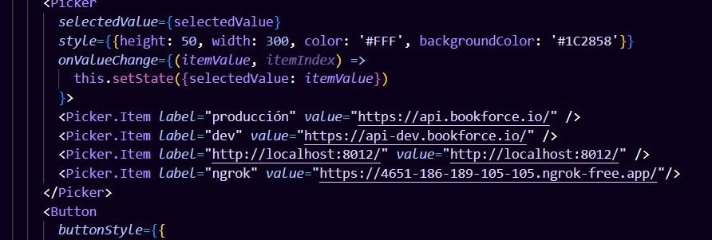

## 1. Aplicación antigua
### 1.1 Seteo de la app

#### 1.1.1 En linux:

- clonar y setear entrekids y bookforce_backend respectivamente, cada una en rama master (al menos entrekids, o morirá).
- clonar repositorio app-validation-qr.
- para correr la app es necesario tener node js, ngrok y npm instalado en el pc, expo go en el teléfono android. (esta versión no incluye ninguna configuración para ios)
- para ngrok hay que crear una cuenta e ingresar token de autenticación en pc.
- abrir una consola, ejecutar:
```
ngrok http 8012
```
- copiar link que se genere y pegar en lista de picker de screen "landing":

- ejecutar:
```
 - npm install 
 - npm start 
```
- en este punto tienes que abrir expo go en tu celular y escanear el código QR que aparece en pantalla.
- yyyyyy debería cargar 🙂 
- en caso de cargar, debería pedirte las credenciales de expo, las tiene Josbert o Brayan.

##### 1.1.1.1 Error de login en expo go:
- si solo te deja meter correo y no te acepta la contraseña, pídele a gpt el comando para limpiar caché de expo e ingresa 
```
npx expo login
```
- debería poderse ahora
- sino bueno, suerte resolviendo 🫡 
##### 1.1.1.2 Versión de la app:
- pasando este problema, está todo listo!
- mentira
- la versión de esta app está en SDK 50 y tu app de expo debe ir en +52 bella 💅 así que no podrá ejecutarla, pero te muestra una pantalla azul que dice algo como "saber cómo ejecutar esta versión de aplicación" o algo así, te debería mandar a este link:
[Link](/content/expo.dev/go?sdkVersion=50&platform=android&device=true)
- descargas la apk del link, desinstalas la app de expo que tienes en tu celular e instalas la apk que descargaste.
- ahora sí, con esta versión de la app escaneas el QR yyyyy debería cargar 🙂 
- si no carga, no sé, no tengo más información, suerte 🍀.

#### 1.1.2 En windows:
- clonar y setear entrekids y bookforce_backend respectivamente en WSL, cada una en rama master (al menos entrekids, o morirá).
- clonar repositorio app-validation-qr EN WINDOWS.
- para correr la app es necesario tener node js y npm instalado en WINDOWS y ngrok en WSL, expo go en el teléfono android. (esta versión no incluye ninguna configuración para ios).
- para ngrok hay que crear una cuenta e ingresar token de autenticación en WSL.
- abrir una consola de WSL, ejecutar:
```
ngrok http 8012
```
- copiar link que se genere y pegar en lista de picker de screen "landing":

- en WINDOWS abrir una consola de cmd, ejecutar:
```
 ipconfig
```
- copiar la dirección IPv4 de la red que estás usando y pegar en el archivo url de la carpeta reducers dentro de redux

estos numeritos:


en este archivo


los reemplazas acá


o no va a funcionar
- luego de todo, ejecutar:
```
 - npm install
 - npm start
```
-y seguir mismo flujo de instalación y ejecución que en linux.

### 1.2 Módulos de la app

#### 1.2.1 Validación de actividades

Como proveedor o staff, al acceder a la aplicación, podrás validar los tickets de tus actividades con un código QR o alfanumérico, también se puede hacer validación por actividad o por proveedor, 
la diferencia en la lógica de estas dos validaciones es que la validación por actividades verifica que el ticket que estás validando corresponde a la actividad  antes de realizar la validación, 
y la otra no.

#### 1.2.2 Temporizador de actividades

Este módulo se utiliza en los locales en sincronización con un servidor local que se inicia en los pc del local y los relojes rojos que verás dando vueltas en la oficina.
Inicializa los relojes y sincroniza con la duración configurada para cada actividad.

#### 1.2.3 Registro de asistencia con reconocimiento facial

Este módulo incluye reconocimiento facial para las funciones de enrolamiento y registro de asistencia. 

- El staff a registrar debe tener rut habilitado para ingresar su asistencia(se puede modificar por panel de control de proveedor o bd)
- Si no tiene su carita registrada, le va a pedir 3 fotos de su cara en la screen enrollment
- Si ya está enrolado, pasará a la Screen AttendanceRegister donde la app verificará si ya tiene la marca de entrada registrada, en caso de ser así mostrará solo el botón de salida, caso contrario muestra ambos botones. Luego tomará su foto y el módulo lo comparará con IA y verá si se parece a su foto registrada anteriormente
- Luego, vuelve al verificador de rut

#### 1.2.4 Historial 

Este módulo *debería* contener la cantidad de verificaciones de tickets que se han realizado. Según Kizzy debería tener más desarrollo, good luck with that. 😶‍🌫️

## 2. Aplicación nueva

### 2.1 Contexto

El requerimiento acá es poder disponibilizar la aplicación inicialmente en Google Play Store, por lo que se inicia nuevo repositorio
y proyecto de app en SDK 52 y nivel de API 34 que es lo que a la fecha de la documentación (18/12/2024) es lo que Google exije como standar 
para disponibilizar apks en la store.
